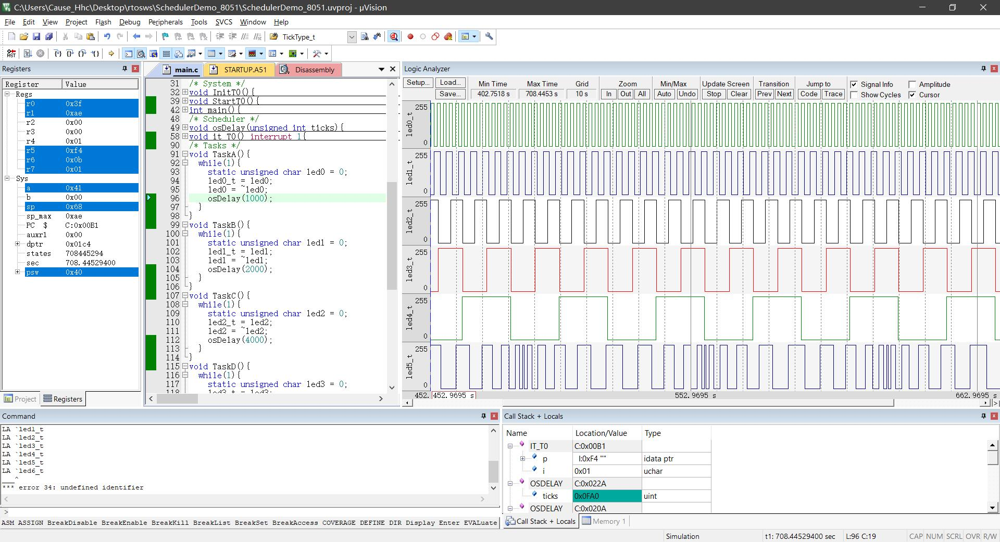

# SchedulerDemo_8051
- 8051架构实现一个调度器，支持时间片多任务系统
- 主要基于定时器中断，修改SP指针及简单的上下文切换（例如任务delay）
## 一、仿真效果

## 二、核心代码
### 1、调度器
```c
void it_T0() interrupt 1{ // Use it_T0 time-sharing scheduler
  unsigned char idata *p;
  unsigned char i;
  led_t = ~led_t;  // just for debug
  if(initFuncIdx<TASKS_NUM){  // FirstTimeFunc Need FIRST getFuncAddr
    if(initFuncIdx>0){  // Dont forget save SP
      funcStkIdx[initFuncIdx-1] = (unsigned char *)SP;
    }
    p = (unsigned char *)SP+1;
    *p++ = ((unsigned int)(func[initFuncIdx]))%256;
    *p = ((unsigned int)(func[initFuncIdx]))/256;
    SP = (unsigned char)p;
	// This value depends on how much SP increases when entering the interrupt, which can be viewed through Debug
    SP += 10;
    initFuncIdx++;
  }else{  // After FirstTimeFunc will be runin this way
    preFuncIdx = curFuncIdx;
    curFuncIdx++;
    if(curFuncIdx>TASKS_NUM-1){
      curFuncIdx = 0;
    }
    funcStkIdx[preFuncIdx] = (unsigned char *)SP;
    SP = (unsigned char)funcStkIdx[curFuncIdx];
    for(i=0; i<TASKS_NUM; i++){  // Refresh the timestamp of each task
      funcDelayList[i]--;
    }
    actualTicks = funcDelayList[curFuncIdx];  // Restore context, eg.ticks
  }
	// Reset someThing
  TH0 = (65536-TICK_RATE_HZ)/256;
  TL0 = (65536-TICK_RATE_HZ)%256;
  led_t = ~led_t;
}
```
### 2、新增任务
- 更新一些变量
```c
/* shce Macro&Func&Var Init*/
#define TICK_RATE_HZ 1000  // Time slice rotation speed
#define TASKS_NUM 2  // ++ for add NewFunc
void TaskA();
void TaskB();
// declare NewFunc
// add NewFunc behind func[]..
void* const func[TASKS_NUM] = {TaskA,TaskB};
```
- 实现
```c
void TaskB(){
  while(1){
	// TODO
    osDelay(2000);
  }
}
```